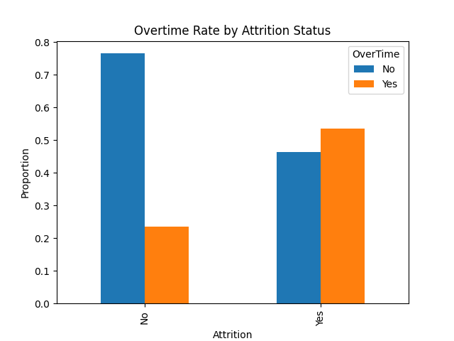
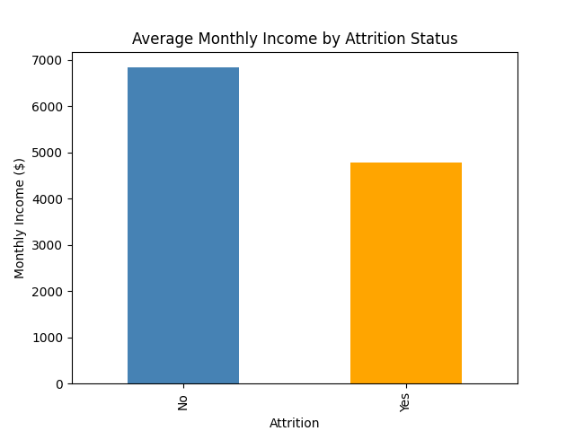
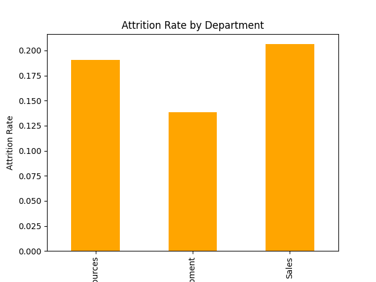

# Employee Attrition Analysis

Analyzing HR data to identify key factors associated with employee turnover, using Python (pandas, matplotlib), with SQL and Power BI planned for deeper exploration.

## Dataset
IBM HR Analytics Employee Attrition dataset — 1,470 employees, 35 features (age, income, department, satisfaction scores, overtime status, tenure, etc.)
Raw data: `WA_Fn-UseC_-HR-Employee-Attrition.csv`

## Key Findings

- **Overall attrition rate: 16.1%** (237 of 1,470 employees)
- **Overtime is the strongest attrition signal**: 54% of employees who left worked overtime, vs. only 23% of those who stayed
- **Income gap**: employees who left earned ~30% less on average ($4,787/mo) than those who stayed ($6,833/mo)
- **Department matters**: Sales has the highest attrition rate (20.6%), R&D the lowest (13.8%)
- **Tenure matters**: employees who left had ~5.1 years at the company vs. 7.4 years for those who stayed
- Job satisfaction was modestly lower among leavers (2.47 vs 2.78 out of 4)

## Visuals

## Tools Used
Python (pandas, matplotlib), Google Colab

## Next Steps
Extending this analysis with SQL queries and a Power BI dashboard.
